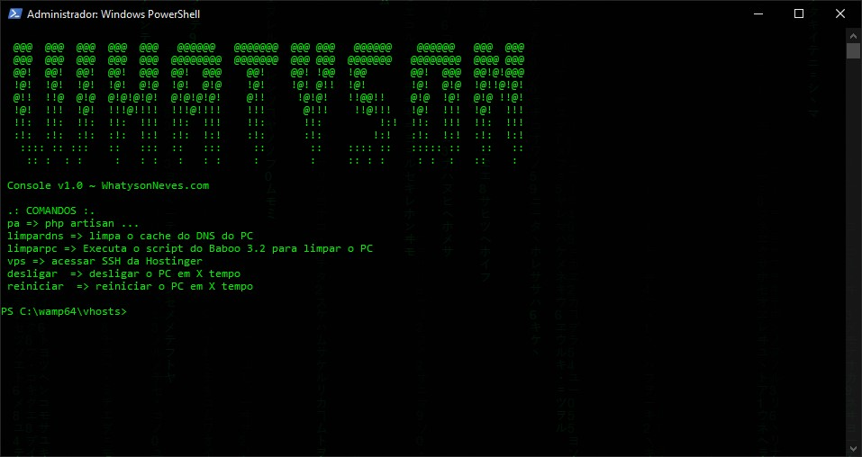

# Console

Habilitando funções e atalhos para facilitar o dia a dia no console :)

   

## Funcionalidades pré criadas:

1. **Função:** limpardns
   - **Executa 3 funções:**
   - ipconfig /flushdns
   - ipconfig /renew
   - Clear-DnsClientCache

2. **Função:** limparpc
   - **Executa o Script do Baboo:** [Acessar o artigo do Baboo](https://baboo.com.br/script)

3. **Função:** pa $args
   - **Executa um atalho para:** *php artisan*
   - pa inspire **executa:** php artisan inspire
   - pa make:model Post -cms **executa:** php artisan make:model Post -cms

4. **Função:** desligar $tempo
   - **Desliga o computador em N minutos**
   - Podendo ser executado sem nenhum tempo ser passado:
   - desligar 1 *desligará o computador em 1 minuto*
   - desligar 10 *desligará o computador em 10 minutos*
   - desligar *desliga imediatamente*

5. **Função:** reiniciar $tempo
   - **Semelhante a função desligar, mas reinicia, ao invés de desligar**
   - Podendo ser executado sem nenhum tempo ser passado:
   - reiniciar 1 *reiniciará o computador em 1 minuto*
   - reiniciar 10 *reiniciará o computador em 10 minutos*
   - reiniciar *reinicia imediatamente*

## Como instalar:

1. Abra o powershell;
2. Execute `notepad $profile`;
3. No arquivo que abrirá, cole o conteúdo do arquivo `Microsoft.PowerShell_profile.ps1`;
4. Salve e feche o powershell;

Pronto, abra novamente o powershell e as funções acima estarão ativadas;
Por padrão, o script do Baboo de limpeza do PC não funcionará de início, acesse [este artigo](https://baboo.com.br/script), baixe e salve em uma pasta do seu computador, copie o caminho do arquivo e altere o script;
Na linha onde está `"ccleaner.bat"` você coloca o caminho completo para o arquivo baixado.

Adicione mais funções, altere o ASCII, be free.
